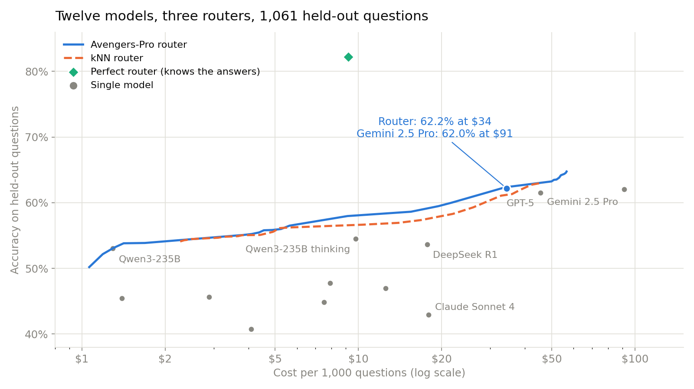
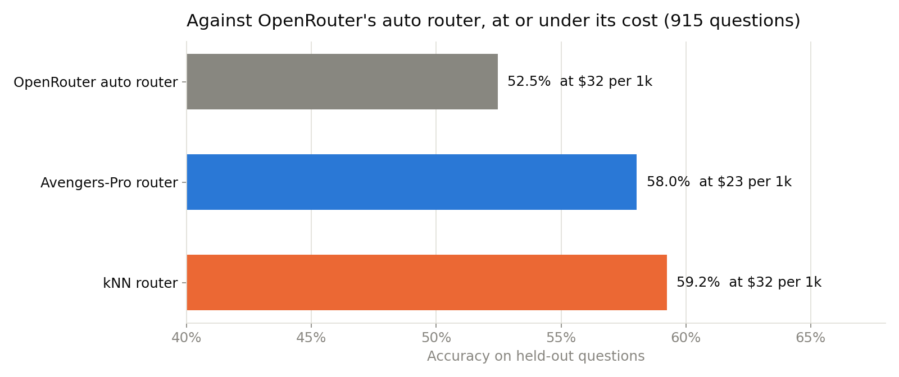

# Train a model router

A model router reads a question and picks one model from a pool, trading
accuracy against cost with one knob. This recipe trains three routers from
the 2025-2026 research on twelve frontier models and scores them on held-out
questions against the best single model, a random pick, the perfect router,
and OpenRouter's auto router.

What you will learn: how a router is trained (it is a table lookup more than
a neural network); why the cluster-based router from Avengers-Pro [1] is the
one to start from; what the knob does to cost and accuracy; and how far every
router still sits from the perfect one. You need `numpy`, `fastembed` and
`huggingface_hub`, and no API key: the answers were already collected by
LLMRouterBench [2]. `--dry-run` needs only `numpy`. `prepare.py` takes about 10
minutes on a laptop CPU once (it downloads 1.3 GB); `run.py` takes about 2.

## Run it

```bash
uv add whileai numpy fastembed huggingface_hub
cd recipes/04-train/model-router
python run.py --dry-run     # offline: a seeded stand-in table, what smoke.sh runs
python prepare.py           # once: download LLMRouterBench, build the table, embed the questions
python run.py               # train three routers, score them on held-out questions
python charts.py            # redraw the two charts from results.json (needs matplotlib)
```

| flag | default | what it does |
|---|---|---|
| `prepare.py --cache` | `raw/` | where the 1.3 GB release lands (7.8 GB extracted) |
| `--out` | `out/` | where the table, embeddings and `results.json` go |
| `run.py --dry-run` | off | stand-in table, no download |

## How a router is trained

**The data is a table.** For every question, LLMRouterBench [2] ran every
model, graded the answer and recorded what it cost. `prepare.py` keeps the
twelve flagship models (GPT-5, GPT-5 Chat, Gemini 2.5 Pro and Flash, Claude
Sonnet 4, DeepSeek R1 and V3, two Qwen3-235B, Kimi K2, GLM-4.6, Intern-S1)
and the twelve datasets all of them answered: AIME, ARC-AGI, three ArenaHard
splits, GPQA, HLE, LiveCodeBench, LiveMathBench, MMLU-Pro, SimpleQA and
SWE-bench Verified. Each dataset is capped at 1,000 questions, which leaves
5,529. Every question is embedded with a 33M-parameter encoder on CPU; the
benchmark found the choice of encoder matters little [2].

**Training is reading the table by neighbourhood.** All three routers answer
one question: on questions like this one, how did each model do, and what
did it cost?

- `knn` [3]: find the 50 most similar training questions and average each
  model's score and cost over them.
- `avengers-pro` [1]: cluster the training questions into 25 groups. In each
  group, score every model on accuracy (normalised across models) and on
  cost. A new question reads its 3 nearest groups. The knob weighs accuracy
  against cost. The settings are the reference implementation's in
  LLMRouterBench.
- `linear` [4]: one ridge regression per model, from embedding to score: the
  parametric baseline, which predicts each model separately and can flip
  rankings on small errors [5].

**The knob.** Each router sweeps a cost weight from 0 (accuracy only) to 1
(cost only). Questions are split 80/20 by a hash of their id (the benchmark's
own ratio). The 80% train part is split again, and the knob is chosen on a
validation slice for three operating points:

- best accuracy;
- the cheapest knob that matches the best single model's accuracy;
- the most accurate knob that costs no more than OpenRouter's auto router.

The router is then refit on all of train and read once on the 1,061 held-out
questions. Every comparison is paired by question through `wai.compare`.
ArenaHard ties (score 0.5) are written as one pass and one fail out of two.

## Result

Held out, 1,061 questions. The routers ran on 2026-10-01 over answers
LLMRouterBench collected in late 2025: no model was called for this recipe.



| | accuracy | USD per 1k questions | vs best single |
|---|---|---|---|
| Gemini 2.5 Pro (best single model on train) | 0.620 | 91.43 | |
| GPT-5 | 0.615 | 45.51 | |
| random model | 0.499 | 18.33 | |
| perfect router (oracle) | 0.822 | 9.18 | +0.202 [+0.179, +0.225] |
| `avengers-pro`, best accuracy | 0.638 | 53.21 | +0.018 [−0.008, +0.043] |
| **`avengers-pro`, matched accuracy** | **0.622** | **34.41** | **+0.001 [−0.027, +0.029]** |
| `knn`, matched accuracy | 0.611 | 32.85 | −0.009 [−0.038, +0.017] |
| `linear`, matched accuracy | 0.621 | 48.44 | +0.001 [−0.022, +0.025] |

**The router keeps the best model's accuracy at 38% of its cost.**
Avengers-Pro at the matched point is about the same as Gemini 2.5 Pro (+0.1
points, interval [−2.7, +2.9]) for $34 per thousand questions instead of
$91. Against GPT-5, which is about as accurate and half Gemini's price, the
saving is 24%. That is close to what Avengers-Pro's authors report against
GPT-5 (27% [1]). It sends 55% of questions to GPT-5, 23% to Qwen3-235B and
the rest to Kimi K2 and the two reasoning models.

**No router is clearly better than the best model, at any price.** The best
accuracy any router reached is +1.8 points [−0.8, +4.3]. The benchmark
reports up to +4% [2].

**Against OpenRouter's auto router**, on the 915 held-out questions the
benchmark ran it on:



| router, at or under OpenRouter's cost | accuracy | USD per 1k | vs OpenRouter auto (0.525, $31.56) |
|---|---|---|---|
| `avengers-pro` | 0.580 | 23.29 | +0.056 [+0.022, +0.087] |
| `knn` | 0.592 | 32.28 | +0.068 [+0.035, +0.098] |

Avengers-Pro is 5.6 points more accurate at 74% of OpenRouter's cost. Read
this as a result about the auto router the benchmark called in late 2025.
OpenRouter has since replaced it with one that picks by task type and
community spend [6].

**Every router is stuck about 19 points below the perfect one.** The oracle
reaches 0.822 at a tenth of Gemini's cost. All three routers land within 2
points of each other, which is the routing plateau [7]: routers that read
only the question learn which model is good at which kind of question, and
miss the questions only one or two models get right.

### Limits

- **One benchmark, answers from late 2025.** Prices and models have moved,
  and so would the routing.
- **The held-out set and the training set come from the same twelve
  datasets.** A router on traffic unlike any of them would do worse.
- **One train/test split.** K-means is the only random step: over five seeds
  Avengers-Pro at the matched point ranges 0.615 to 0.623 in accuracy and
  $32.82 to $34.41 per 1k. The point closest to OpenRouter's cost varies
  more ($21.60 to $32.66), because two knob settings sit close on val.
- **Costs are what the benchmark recorded**, including reasoning tokens. A
  router that picks a reasoning model pays for its thinking.

## Next

The plateau says the next gain comes from reading more than the question: the
start of a model's answer [7], or a small open model's internal activations
as it reads the prompt [8]. To route your own traffic, replace the table with
your questions, each model's graded answer and its cost (`recipes/02-measure/model-router`
collects exactly that for two models), and keep `run.py`.

## References

1. Zhang et al. 2025. *Beyond GPT-5: Making LLMs Cheaper and Better via
   Performance-Efficiency Optimized Routing.* arXiv:2508.12631.
2. Li et al. 2026. *LLMRouterBench: A Massive Benchmark and Unified Framework
   for LLM Routing.* Findings of ACL 2026. arXiv:2601.07206.
3. Li 2025. *Rethinking Predictive Modeling for LLM Routing: When Simple kNN
   Beats Complex Learned Routers.* arXiv:2505.12601.
4. Hu et al. 2024. *RouterBench: A Benchmark for Multi-LLM Routing System.*
   arXiv:2403.12031.
5. Lai and Ye 2026. *When Routing Collapses: On the Degenerate Convergence of
   LLM Routers.* arXiv:2602.03478.
6. OpenRouter. *Auto Router.* openrouter.ai/docs/guides/routing/routers/auto-router,
   read 2026-10-01.
7. Lu et al. 2026. *The Routing Plateau: Understanding the Accuracy Limits of
   LLM Routers.* arXiv:2606.07587.
8. Varshney et al. 2026. *LLM Router: Rethinking Routing with Prefill
   Activations.* arXiv:2603.20895.
