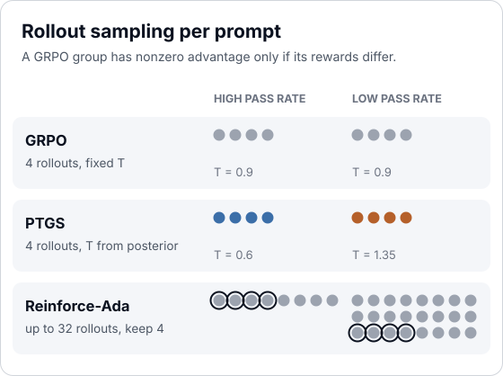
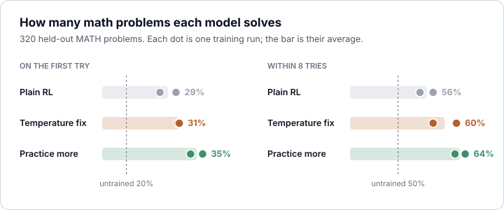
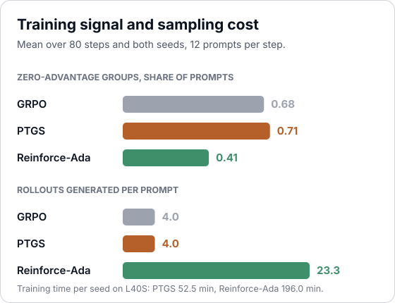
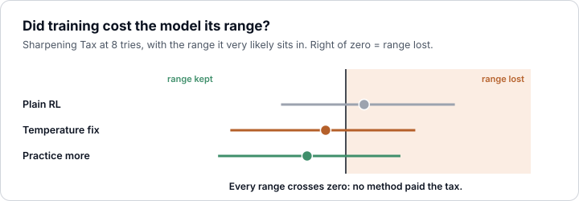

# Benchmarking PTGS against Reinforce-Ada and GRPO

We benchmark PTGS, Reinforce-Ada and GRPO on MATH levels 3 to 5 with Qwen2.5-1.5B, two seeds per arm.

**Result:** PTGS matched GRPO on pass@1 (+0.004 [-0.017, +0.025], flat), Reinforce-Ada exceeded GRPO on both seeds (+0.031 [+0.007, +0.054]) at 3.7x the training time, and no arm paid a Sharpening Tax at k = 8.



## Result



| Comparison | Δ pass@1, seed-17 pair [95% CI] | Δ pass@8, seed-averaged [95% CI] | Verdict |
|---|---|---|---|
| PTGS - GRPO | +0.004 [-0.017, +0.025] | +0.039 [+0.011, +0.069] | flat |
| Reinforce-Ada - GRPO | +0.031 [+0.007, +0.054] | +0.072 [+0.036, +0.106] | flat (under the 0.051 re-run band) |
| PTGS - Reinforce-Ada | -0.027 [-0.048, -0.006] | -0.033 [-0.063, -0.002] | flat |

pass@1 intervals are `wai.compare` over 320 paired tasks; pass@8 intervals are a task bootstrap on seed-averaged curves and do not include seed variance. A verdict of "moved" needs the interval to exclude zero and the delta to clear the eval's re-run band (t at 2 df x sqrt(2) x run_std = 0.051).



- **Mechanism:** PTGS did not reduce zero-advantage groups (0.71 vs 0.68). Heating rarely lifted a failing prompt's pass rate, and cooling turned high-pass-rate groups all-correct, which also zeroes the advantage (the paper's Proposition 5). Reinforce-Ada cut them to 0.41 by sampling 23.3 rollouts per prompt.



- **No tax at this scale:** every arm raised pass@8 over the base (0.503). The paper reports the tax for fully post-trained checkpoints at k up to 128; 80 LoRA steps on a 1.5B model at k = 8 did not reach it.

## The paper

**Paper:** Sharpening Tax in Post-Training, Changdae Oh et al., arXiv:2610.01509, October 2026. https://arxiv.org/abs/2610.01509
**Book:** GRPO's advantage is a reward minus its group's mean, so a group whose rollouts all scored the same contributes no gradient [1][2].
**Claim:** RL post-training concentrates per-prompt pass rates at 0 and 1, raising pass@1 and lowering pass@k (the Sharpening Tax); sampling each prompt's group at a temperature set by a Beta posterior over its pass rate reduces the tax and raises both [7].
**The change:** the rollout temperature. GRPO samples every prompt at T = 0.9; PTGS samples prompt x at T = 0.9 x 1.5^h(p̂), with p̂ drawn from Beta(2p~ + s, 2(1 - p~) + f) and log-probs taken at the same T. Reinforce-Ada keeps T = 0.9 and samples up to 32 rollouts [3].

## Recipe

| | |
|---|---|
| Model | `Qwen/Qwen2.5-1.5B-Instruct`, LoRA r = 32, TRL 0.19.1 GRPO, lr 1e-4, no KL, on-policy, no std normalization |
| Update | 80 steps x 12 prompts x 4 rollouts in every arm (48 per step) |
| Data | MATH train levels 3 to 5, 192 prompts (5 visits each); MATH-500 levels 3 to 5, 320 held out |
| Reward | binary, `MathEqual` (Math-Verify) against the reference answer |
| PTGS | tau 1.5, gamma 0.95, p~ 0.25 to 0.5 geometric, prior mass 2 (the paper's PPO setting, Appendix A.5) |
| Reinforce-Ada | `wai.methods.ReinforceAda`: balanced exit, rounds of 8, at most 32, keep 4, pool pass-rate baseline |
| Eval | k = 8 samples per task at T = 0.9, seeds 17 and 18 per arm, base evaluated 3 times |

## Run

```bash
python recipe.py --selftest   # the temperature rule and the tax, no GPU
python recipe.py              # three arms x two seeds, six L40S in parallel
python figures.py             # redraw the figures from results.json
```

## Checks

| Check | Source | Result |
|---|---|---|
| Eval noise: the base evaluated 3 times, `eval_variance` run_std | [4] | run_std 0.008 (0.20, 0.20, 0.19); a single-pair delta under 0.051 reads flat |
| Holdout is clean: `decontaminate(train, against=holdout)` | [5] | 0 of 192 dropped |
| Reward is a program, not a judge | [5] | `MathEqual` against the MATH-500 answer |
| Proxy vs target: `wai.compare(proxy=)` | [6] | `proxy=None`; over_optimized false |
| Length: mean completion length before -> after, per arm | [6] | 1,379 chars -> 1,198 GRPO, 1,147 PTGS, 1,021 Reinforce-Ada |
| Hack scan on the last training batch: `hack_scan` | [6] | LaTeX and arithmetic surface only, nothing endorsed |
| Pinned: seed, torch, transformers, trl, peft | [the contract](../README.md#the-contract) | seeds 17, 18; torch 2.7.1, transformers 4.54.0, trl 0.19.1, peft 0.16.0 |

## Climb

| Round | What changed | pass@1 (seed 17 / 18) | vs plain RL |
|---|---|---|---|
| 1 | the paper's PPO setting, beside GRPO and Reinforce-Ada | GRPO 0.31 / 0.27, PTGS 0.31 / 0.32, Ada 0.34 / 0.37 | PTGS +0.004 [-0.017, +0.025], flat |

## Learned

- Low-pass-rate prompts needed more samples, not a higher temperature: Reinforce-Ada cut zero-advantage groups from 0.68 to 0.41, PTGS raised them to 0.71. Theorem 3 of the paper assumes heating raises p; at 1.5B on MATH it mostly did not.
- PTGS adds no generation cost. In TRL 0.19.1 it is a per-row logits processor on `generate` and a per-row temperature divisor in `_get_per_token_logps`.
- Next: the paper's GRPO setting (tau 1.4, p~ fixed at 0.5) and k = 64 on the holdout, so Tax_S has room to move.

Verified 2026-10-02, whileai 0.127, TRL 0.19.1. 804 GPU minutes, $26.79 on L40S. Run page: https://while.ai/platform/training/run_ef3d2f55c789144d

## References

1. Shao, Z. et al. DeepSeekMath: Pushing the Limits of Mathematical Reasoning in Open Language Models. arXiv:2402.03300, 2024.
2. Lambert, N. Reinforcement Learning from Human Feedback. arXiv:2504.12501, 2025. Chapter *Reinforcement Learning*.
3. Xiong, W. et al. Reinforce-Ada: An Adaptive Sampling Framework under Non-linear RL Objectives. arXiv:2510.04996, 2025.
4. Lambert, N. Reinforcement Learning from Human Feedback. arXiv:2504.12501, 2025. Chapter *Evaluation*.
5. Lambert, N. et al. Tülu 3: Pushing Frontiers in Open Language Model Post-Training. arXiv:2411.15124, 2024.
6. Gao, L., Schulman, J., Hilton, J. Scaling Laws for Reward Model Overoptimization. ICML 2023. arXiv:2210.10760.
7. Oh, C. et al. Sharpening Tax in Post-Training. arXiv:2610.01509, 2026.
